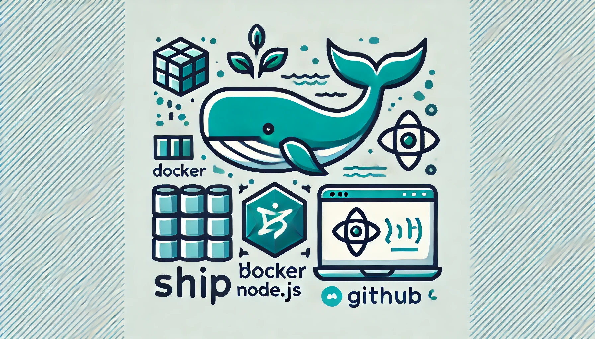

# Ship
A simple Bash script to automate the setup of a new Node.js project within a Docker container environment. This tool allows you to create and manage Node.js projects without needing Node.js installed on your local machine, inspired by the ease of use of Laravel Sail.

## Features
- **Automated Docker Setup**: Creates a new Dockerized Node.js project with a `Dockerfile` and `docker-compose.yml`.
- **Node.js Version Selection**: Prompts you to choose the Node.js version for the container.
- **Portable Development Environment**: Run, build, and manage your project in a consistent environment across different machines.
- **Lightweight & Customizable**: Uses an Alpine-based Node.js image to keep the container size minimal.
- **Easy Container Management**: Provides a helper script (`ship`) for common Docker operations, similar to Laravel Sail.

## Getting Started

### Prerequisites
Ensure you have [Docker](https://docs.docker.com/get-docker/) installed and running on your machine.

### Installation

1. Clone the repository or download the `ship-init.sh` script.
2. Make the script executable:
   ```bash
   chmod +x ship-init.sh
   ```

### Usage

1. **Run the Script**
   Execute the script to create a new Node.js project:
   ```bash
   ./ship-init.sh
   ```

2. **Follow the Prompts**
   - Enter a project name.
   - Enter the desired Node.js version (e.g., `14`, `16`, `18`).

3. **Build and Start the Container**
   The script will automatically build and start a Docker container for your project. You can then use the `ship` helper to manage your container.

### Managing Your Project

The helper script `ship` is included to simplify container operations:

- **Build the Container**
   ```bash
   ./ship build
   ```

- **Start the Container**
   ```bash
   ./ship up
   ```

- **Stop the Container**
   ```bash
   ./ship down
   ```

- **Run Commands Inside the Container**
   ```bash
   ./ship <command>
   ```
   For example:
   - Open a shell: `./ship sh`
   - Install a package: `./ship npm install <package_name>`

## Project Structure
After running the script, your project directory will contain:
```
/<project_name>
  |-- Dockerfile              # Defines the Node.js Docker image
  |-- docker-compose.yml      # Configures Docker services
  |-- ship                    # Helper script for container commands
  |-- package.json            # Initialized Node.js project file
  |-- (other project files)   # Any files you add to the project
```

## Notes
- The container is initialized with a basic `npm init -y` command, allowing you to immediately start working on your Node.js project.
- The container does not expose any ports initially, but you can customize the `docker-compose.yml` file to add ports, environment variables, or other services as needed.

## Troubleshooting
- **Docker is not running**: If Docker is not running, the script will print an error message. Make sure to start Docker before running the script.

## Contributing
Contributions are welcome! Please open an issue or submit a pull request if you have any improvements or suggestions.

## License
This project is licensed under the MIT License - see the [LICENSE](LICENSE) file for details.
